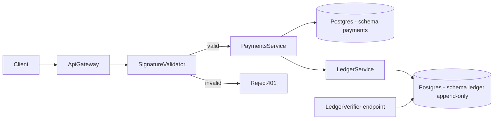

# abc-pay - ASR-SEG-02 Demo

Demonstrator for the **Security & Integrity** quality attribute (ASR-SEG-02) of the
abc-pay platform. Two tactics are implemented and measured:

- **Verify Message Integrity** at the API gateway via an HMAC-SHA256 signature
  check (`Validador de Firmas`).
- **Maintain Audit Trail** via an append-only, hash-chained ledger
  (`Ledger Inmutable`).

The repository ships a containerized stack and an automated experiment harness
that exercises scenarios `A1-A5` (integrity) and `B1-B4` (audit trail) and
records false negatives, latencies, and an overall pass/fail verdict.

## Architecture



| Component | Port | Responsibility |
|-----------|------|----------------|
| `api-gateway` | 8080 | Entry point. Calls validator, then routes "tráfico íntegro" to payments. |
| `signature-validator` | 8081 | Recomputes HMAC over (method, path, body, timestamp, idem-key). Rejects on mismatch or replay. |
| `payments-service` | 8082 | Business logic. Persists payment row + appends audit event. |
| `ledger-service` | 8083 | Append-only ledger with chained hashes + chain verifier. |
| `postgres` | 5432 | Two schemas: `payments`, `ledger`. |

## Layout

```
abc-pay/
├── settings.gradle.kts          # Gradle multi-project (Kotlin DSL)
├── build.gradle.kts
├── docker-compose.yml
├── shared/security-lib/         # Canonicalizer, HmacSigner, HashChain
├── services/
│   ├── api-gateway/
│   ├── signature-validator/
│   ├── payments-service/
│   └── ledger-service/
├── tests/experiments/           # A1-A5 / B1-B4 harness (CLI app)
├── infra/postgres/init/         # SQL schema
└── scripts/                     # smoke.sh, run-experiments.sh
```

## Prerequisites

- Docker and Docker Compose
- (Optional) JDK 21 + Gradle 8.10 if you want to run things outside Docker

If you have neither Gradle nor a wrapper installed locally, the experiment
script automatically falls back to a Dockerized Gradle image.

## Quick start

```bash
docker compose up -d --build
./scripts/smoke.sh             # one signed POST through the full stack
./scripts/run-experiments.sh   # full A + B suites with reports
./scripts/load-demo.sh         # mixed traffic + live Grafana dashboard
./scripts/reset-metrics.sh     # wipe Prometheus + reset service counters
```

Reports are written to `reports/`:

- `results.json` - machine-readable per-scenario results plus summary
- `results.csv` - same data flat
- `report.md` - presentation-ready markdown with tables A and B

## Live demo (Prometheus + Grafana + Artillery)

The Compose stack also boots a Prometheus scraper and a Grafana instance
pre-loaded with the dashboard `ASR-SEG-02 - Live Telemetry`.

```bash
./scripts/load-demo.sh
# then open http://localhost:3000/d/asr-seg-02
```

The Artillery scenario in [tests/load/scenarios.yml](tests/load/scenarios.yml)
sends a mixed traffic profile at the gateway: 80% valid signed payments and
20% split across the four tampering attacks (`A1` bit-flip, `A2` header
tamper, `A3` signature swap, `A4` stale replay). The validator's
`abcpay_validation_total{result, reason}` counter drives the headline panel.

| URL | Purpose |
|-----|---------|
| http://localhost:3000/d/asr-seg-02 | Grafana dashboard (anonymous viewer) |
| http://localhost:9090 | Prometheus UI |
| http://localhost:8081/actuator/prometheus | Validator raw metrics |

## API documentation (Swagger)

Each microservice exposes an interactive Swagger UI and an OpenAPI 3 JSON spec.
You can call the endpoints directly from the UI (helpful for poking the ledger
or checking a verdict from the validator without writing curl).

| Service | Swagger UI | OpenAPI JSON |
|---------|------------|--------------|
| API gateway | http://localhost:8080/swagger-ui.html | http://localhost:8080/v3/api-docs |
| Signature validator | http://localhost:8081/swagger-ui.html | http://localhost:8081/v3/api-docs |
| Payments service | http://localhost:8082/swagger-ui.html | http://localhost:8082/v3/api-docs |
| Ledger service | http://localhost:8083/swagger-ui.html | http://localhost:8083/v3/api-docs |

Note: requests to `POST /api/payments` on the gateway require valid HMAC
signing headers. The Swagger UI lets you set them, but for end-to-end
demonstrations it's easier to use `scripts/smoke.sh`, which signs and sends a
request for you.

To change the traffic mix, edit the `weight` values in
`tests/load/scenarios.yml` and re-run the script. To tune the attack
intensity (or run a quick 30s burst), use:

```bash
npm --prefix tests/load run quick
```

## How the integrity check works

The client builds a signature over a deterministic byte sequence:

```
HMAC_SHA256(secret, METHOD || \n || PATH || \n || RAW_BODY || \n || TIMESTAMP || \n || IDEMPOTENCY_KEY)
```

The signature plus the timestamp and idempotency key are sent as headers. The
server recomputes the HMAC over the **bytes it received** (no
re-canonicalization), enforces a configurable timestamp skew window, and only
forwards verified traffic to the payments service.

## How the immutable ledger works

Every payment writes one row in `ledger.ledger_entry`:

| field | meaning |
|-------|---------|
| `seq` | monotonically increasing position |
| `payload_hash` | SHA-256 of canonical JSON payload |
| `prev_hash` | record_hash of seq-1 (or genesis for seq=1) |
| `record_hash` | SHA-256 over (seq, eventId, eventType, payload_hash, prev_hash, createdAt) |

The verifier endpoint walks the chain from genesis. Any deletion, mutation,
forged insert, or reorder breaks at least one of `payload_hash`, `prev_hash`,
or `record_hash` and is reported as a failure.

The service exposes only `POST /api/ledger/append` and `GET /api/ledger/verify`.
There is no UPDATE/DELETE endpoint by design.

## Scenarios

### Table A - Verify Message Integrity

| ID | Attack | Expected |
|----|--------|----------|
| A1 | Flip one bit in JSON body | reject |
| A2 | Change a header included in the MAC (timestamp) | reject |
| A3 | Apply a valid MAC to a different body | reject |
| A4 | Replay outside the allowed timestamp window | reject |
| A5 | Benign signed request (control) | accept |

### Table B - Maintain Audit Trail

| ID | Tampering | Expected |
|----|-----------|----------|
| B1 | Delete the latest row | verifier fails |
| B2 | Alter a field in a middle row | verifier fails |
| B3 | Insert a forged row without fixing the chain | verifier fails |
| B4 | Reorder rows (swap two payloads) | verifier fails |

Success criterion: zero false negatives across all in-scope tampering cases.

## Tuning the experiment

| Variable | Default | Meaning |
|----------|---------|---------|
| `ABCPAY_INTEGRITY_ITERATIONS` | 100 | Iterations per A scenario |
| `ABCPAY_LEDGER_ITERATIONS` | 10 | Iterations per B scenario |
| `ABCPAY_LEDGER_SEED_SIZE` | 20 | Events appended before each B mutation |
| `ABCPAY_SHARED_SECRET` | `dev-shared-secret-change-me` | HMAC secret |

## Secret isolation

See [docs/architecture/secret-isolation.md](docs/architecture/secret-isolation.md)
for the request flow plus a diagram of which services hold the HMAC secret
and which do not.

## AWS evolution

See [docs/architecture/aws-transition.md](docs/architecture/aws-transition.md).

## Out of scope

- Compromise of signing key material
- Compromise of the validator binary itself
- Build-time supply chain tampering
- Spoofing tactics (planned for the next iteration alongside the risk engine)
