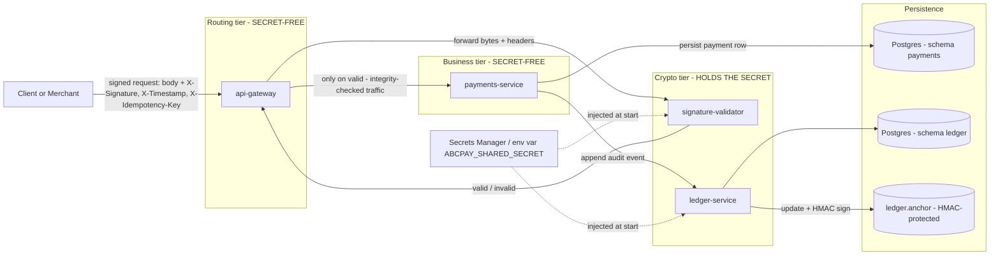
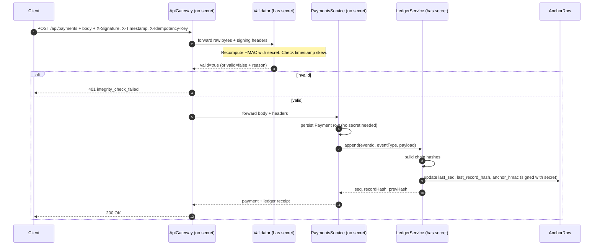
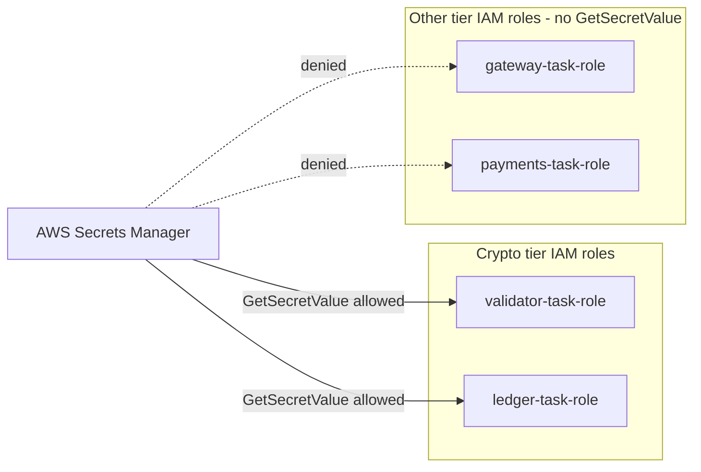

# Secret Isolation - Where the HMAC Key Lives

This document explains the deliberate decision to keep the HMAC shared secret
out of the routing tier and the business tier. It is part of how the
**Verify Message Integrity** tactic of ASR-SEG-02 is realized in code.

## TL;DR

Only two components in the system ever read `ABCPAY_SHARED_SECRET`:

1. `signature-validator` - to recompute the HMAC over each inbound request.
2. `ledger-service` - to compute the HMAC over the tamper-evident anchor row.

The `api-gateway` and the `payments-service` never see the secret. They do
not need it to do their jobs, so they are never trusted with it. If either is
compromised, the attacker still cannot forge a valid signature.

## Component view: secret ownership



The dashed lines from `Secrets Manager / env var` show the only two places the
secret is provisioned. There is no path from `Gateway` or `Payments` to the
secret store.

## Why this shape

| Property | Effect |
|----------|--------|
| Smaller blast radius | Compromise of the gateway or payments service does not yield the secret. |
| Smaller audit boundary | Only two services need the heavy security review and key rotation drill. |
| Independent rotation | Secret rotation only redeploys validator + ledger; routing tier stays online. |
| Independent scaling | HMAC compute scales with validator pods, decoupled from routing. |
| Pluggable algorithm | Swapping HMAC for JWS or HSM-backed signing changes only the crypto tier. |

The cost is the extra hop `Gateway -> Validator -> Gateway -> Payments`. Our
implementation **fails closed** if the validator is unreachable: the gateway
returns HTTP 503 instead of letting unverified traffic through.

## Request flow with annotations on the secret



The sequence makes two important things visible:

- The **secret never crosses the wire** between services. Each service that
  has it only ever performs HMAC operations locally.
- The **anchor row is signed** with the same secret. An attacker who only has
  database write access cannot forge an anchor without the secret, so tail
  deletion and orphan rows are detected by the verifier.

## Mapping to the Iteration 2 (AWS) deployment

The same ownership boundaries hold in the cloud target. Only two task roles
are granted permission to read the secret from AWS Secrets Manager:



This is a textbook application of least privilege at the IAM layer and is
worth calling out in the report as the cloud-native realization of the same
property we already enforce locally via environment variables.

## How to verify the property in the running system

A few quick checks confirm the boundaries:

1. The gateway container does not have `ABCPAY_SHARED_SECRET` in its env:
   ```bash
   docker exec abcpay-api-gateway env | grep -i secret || echo "OK: no secret"
   ```
2. The validator does:
   ```bash
   docker exec abcpay-signature-validator env | grep ABCPAY_SHARED_SECRET
   ```
3. The payments service does not:
   ```bash
   docker exec abcpay-payments-service env | grep -i secret || echo "OK: no secret"
   ```
4. The ledger does:
   ```bash
   docker exec abcpay-ledger-service env | grep ABCPAY_SHARED_SECRET
   ```

If you ever see step 1 or step 3 print the secret, an architectural
boundary has been broken and should be reverted.
